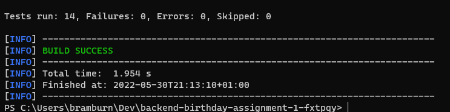
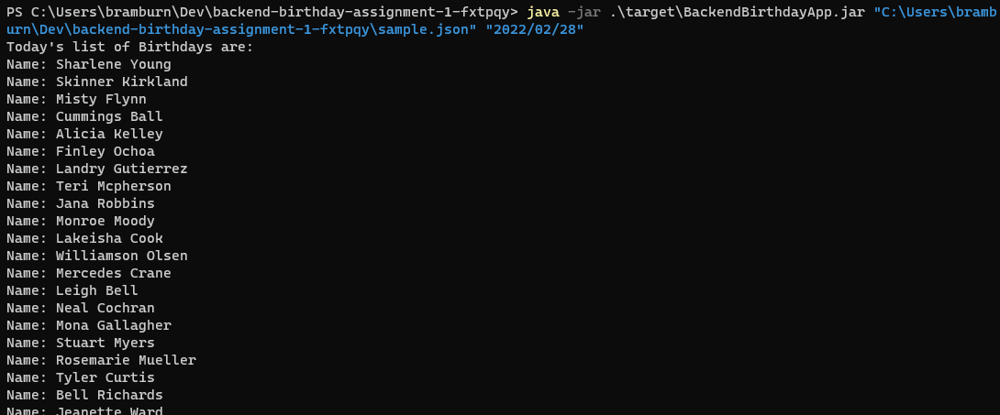
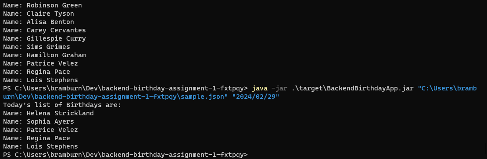

# Intro

Codesubmit interview test for Bhavesh Ramburn
- Email: nitrogen@gmail.com

# Instruction

## Requirements

- Java SDK 11
- Maven
- Windows 10 (Only tested on this OS)

## Steps

Step 1)

Make sure you have Java SDK installed from [Java](https://www.oracle.com/java/technologies/downloads/)
as well as Maven

Run the following after you have maven and the JDK.

```shell
mvn compile 
```

or 

```shell 
mvn dependency:resolve
```

Step 2)

Testing the application.

With Maven installed you can use `mvn test` to run the test



Step 3)

To run the application you can run the following:

Build the jar file 

```shell
mvn clean
mvn package
```


Running the jar file

Args:

- 1 = Required = absolute file path to formatted json
- 2 = Optional = Date

```shell
java -jar target/BackendBirthdayApp.jar "<<absolute path to .json file>>" "<<optional: Date in YYYY/MM/DD>>"
```
_Please make sure JAVA is set on your path_

Examples:

Testing any given day

```shell
java -jar target/BackendBirthdayApp.jar "C:\Users\bramburn\Dev\backend-birthday-assignment-1-fxtpqy\sample.json" "2000/04/02"
```


Testing February 29th
```shell
java -jar .\target\BackendBirthdayApp.jar "C:\Users\bramburn\Dev\backend-birthday-assignment-1-fxtpqy\sample.json" "2022/02/28"
```


Testing February 28th
```shell
java -jar .\target\BackendBirthdayApp.jar "C:\Users\bramburn\Dev\backend-birthday-assignment-1-fxtpqy\sample.json" "2024/02/29"
```



# Assumptions

Here is a list of assumptions I've had during building the application:
I assume :

- The application will receive 2 args, 1 to the path of the .json file in the format in the requirements.md
- The file location is absolute
- The date format is YYYY/MM/DD
- You require the ability to replace the UI, Infrastructure, or Application


# Todo

Some todos:

- Implementing dependency injection - I'm not worked with any standalone DI packages
- Improve build for cleaner JAR
- Creating a Singleton for the driver
- Improve tests to include failures, I was struggling to get Junit to work properly
- Split the Controller so that it reads arguments from a separate class instead of passing it directly
- Implement the resources reference properly so that it links to the app
- Setup args to use without absolute path


